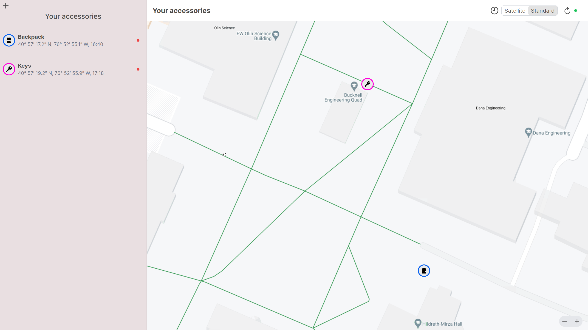

# CRAB GPS Tracker Production

A GPS tracking system to be able to locate lost items.



## Setup

1. Please run the `setup.sh` file to get started. This will create the Python virtual environment with the necessary packages installed.
   c

```sh
$ sh setup.sh
```

2. After activate the Python virtual environment in the current shell by running the following:

```sh
$ source iot-env/bin/activate
```

3. Activate the conda and install mariadb.

```sh
$ conda activate
$ python -m pip install mariadb==1.0.11
```

4. Run the `requirements.txt` at the root of the directory.

```sh
$ pip install -r requirements.txt
```

5. Create a `.env.local` file with the following environment variables or copy the provided template `.env.example` to `.env.local` under the the `webserver/` directory.

```yaml
NEXT_PUBLIC_FLASK_API_URL=
NEXT_PUBLIC_GOOGLE_MAPS_API_KEY=
```

**Leaving NEXT_PUBLIC_FLASK_API_URL blank will use localhost:5000.**

6. Create a `secret.py` file under the `webserver/` directory and `database/` directory and fill the following fields.

```py
dbhost=""
db=""
user=""
password=""
```

These login credentials are a need for accessing MariaDB.

7. Download packages for the front end under the `webserver/` directory.

```sh
$ npm install
```

You'll have to run `python3 flask_api.py`for the API and `npm run dev` for the webserver under `webserver/` and `python3 fake_data_demo.py` under `database/`.

## Components

- [Pico W](https://www.adafruit.com/product/5526)
- [GPS Module](https://www.adafruit.com/product/4415)

## Tech Stack

- [Flask](https://flask.palletsprojects.com/en/3.0.x/)
- [React](https://react.dev/)
- [Next.js](https://nextjs.org/)

We're going to be using the each for the following reasons:

**Backend**: Flask is responsible for handling our server side logic like interacting with the databases, authentication, and serving API endpoints. It uses Flask-RESTful for creating RESTful APIS and Flask-SocketIO for our websocket

**Frontend**: React is used to build the user interface of the application.

**Server**: Next.js will render the React components on the server before sending it to the client. We are using the `create-next-app` to setup a Next.js project.

## Websocket and RESTful

We're using both because in some instance our applications needs to get real-time data. We could use the RESTful API and poll the server periodically and eventually
get a different response. However, for most of the time you'll be receiving the same response and waisting resources.

Reference: [Is ReST over websockets possible?](https://stackoverflow.com/questions/13373734/is-rest-over-websockets-possible)

## How do you integrate the Tech Stack together?

We'll be using API routes. The routes will be used to proxy request to our Flask backend.

## Note on the environment variables

You'll learn throughout using `.env` that you need to prefix environment variables to access them only in certain components, such as `NEXT_PUBLIC_` to expose these variables to the client-side code. Read more on [environment variables on the next.js site](https://nextjs.org/docs/pages/building-your-application/configuring/environment-variables).
